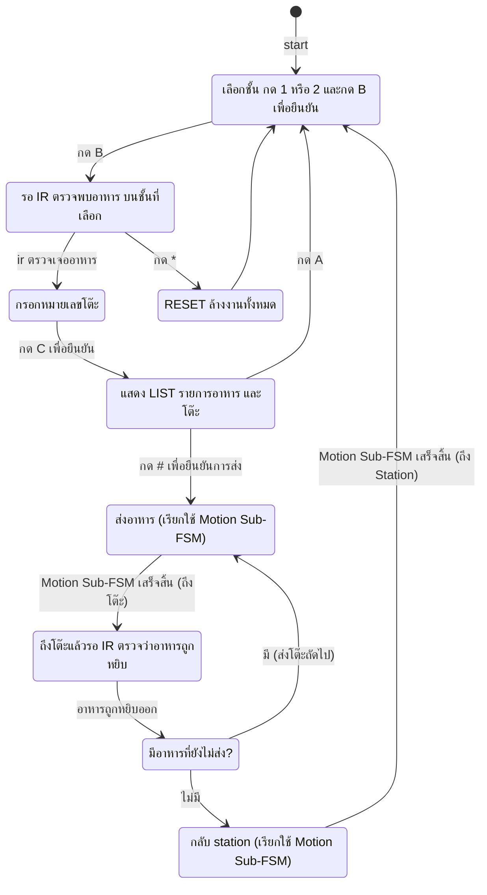
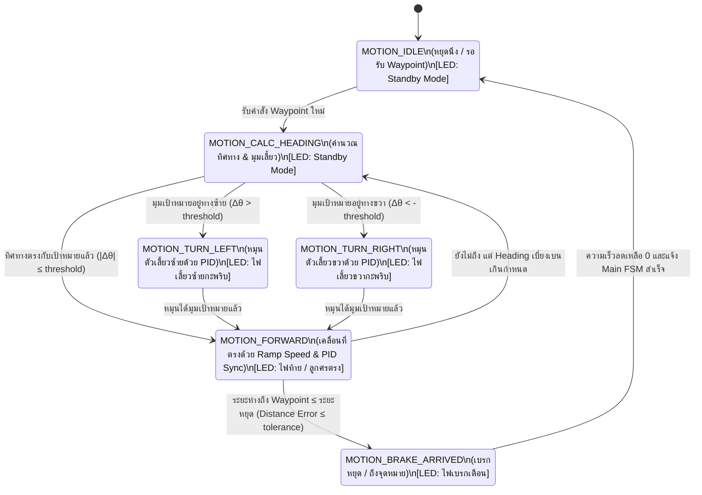

# Finite State Machine (FSM) - ระบบหุ่นยนต์ส่งอาหาร

## 1. Main Delivery FSM (ระบบจัดการการส่งอาหาร)

---

## 2. Motion & LED Matrix Sub-FSM (ระบบควบคุมการเคลื่อนที่และไฟเลี้ยว)

เมื่อ Main FSM อยู่ในสถานะ `Delivering` หรือ `ReturnStation` ระบบจะส่งเป้าหมายพิกัด Waypoint $(x, y)$ ไปยัง **Motion Sub-FSM** เพื่อควบคุมมอเตอร์ร่วมกับ Encoder (คำนวณ Odometry $x, y, \theta$) และสั่งการแสดงผลบน **LED Matrix** แบบ Non-blocking พร้อมกัน

---

### รายละเอียดการทำงานของ Motion & LED Subsystem

#### A. การคำนวณตำแหน่งแบบ Odometry (Dead Reckoning)
ระบบอ่านค่าจาก Interrupt ของ Left/Right Encoder ทุก ๆ Control Loop (50 Hz):
- $\Delta d_{left} = \Delta \text{ticks}_{left} \times \text{METERS\_PER\_PULSE}$
- $\Delta d_{right} = \Delta \text{ticks}_{right} \times \text{METERS\_PER\_PULSE}$
- $\Delta d = \frac{\Delta d_{right} + \Delta d_{left}}{2}$
- $\Delta \theta = \frac{\Delta d_{right} - \Delta d_{left}}{\text{WHEEL\_BASE}}$
- อัปเดตพิกัด:
  $$x \leftarrow x + \Delta d \cdot \cos(\theta + \frac{\Delta \theta}{2})$$
  $$y \leftarrow y + \Delta d \cdot \sin(\theta + \frac{\Delta \theta}{2})$$
  $$\theta \leftarrow \theta + \Delta \theta$$

#### B. การควบคุมความเร็ว (Motion Profiling & Synchronization)
1. **Ramping (Accel/Cruise/Decel)**: ปรับอัตราเร่งขึ้นแบบนุ่มนวล และคำนวณจุด Deceleration Distance ล่วงหน้าเพื่อไม่ให้หัวทิ่มหรืออาหารหก
2. **PID & Wheel Sync**: ใช้ PID คุมความเร็วแต่ละล้อ พร้อม cross-coupling sync ($K_{sync}$) รักษาทิศทางตรง

#### C. การจัดการ LED Matrix (Non-blocking Engine via `millis()`)
- LED Matrix ไม่ใช้ฟังก์ชัน `delay()` เพื่อไม่รบกวน PID loop 50Hz
- อัปเดตแอนิเมชันผ่านตัวแปรจับเวลา `millis()` ตามสถานะของ Motion Sub-FSM:
  - **MOTION_TURN_LEFT**: รันแอนิเมชันลูกศรวิ่งชี้ไปทางซ้าย กะพริบทุก 200–250 ms
  - **MOTION_TURN_RIGHT**: รันแอนิเมชันลูกศรวิ่งชี้ไปทางขวา กะพริบทุก 200–250 ms
  - **MOTION_FORWARD**: ไฟแถบด้านท้ายวิ่ง หรือไฟสีปกติแสดงสถานะกำลังเดินหน้า
  - **MOTION_BRAKE_ARRIVED**: ไฟกระพริบสีแดงเตือนเบรก/จอด
  - **MOTION_IDLE**: แสดงไฟหรี่หรือโลโก้ Standby
