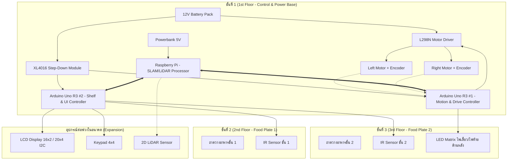

# Hardware & System Architecture Design

เอกสารนี้รวบรวมรายละเอียดการออกแบบฮาร์ดแวร์ โครงสร้างทางกายภาพ สถาปัตยกรรมตัวควบคุม และการจัดสรรอุปกรณ์ในแต่ละชั้นของหุ่นยนต์ส่งอาหารอัตโนมัติ

---

## 1. โครงสร้างทางกายภาพและระบบขับเคลื่อน (Mechanical & Chassis)

หุ่นยนต์ใช้โครงสร้างแบบ 3 ชั้น (3-Tier Structure) ขับเคลื่อนด้วยระบบ **Differential Drive (Tank Turn)** เพื่อให้สามารถหมุนกลับตัวในพื้นที่แคบได้โดยไม่ต้องมีเพลาเลี้ยว

```
         +-------------------------------+
         |    3rd Floor: Food Plate 2    | <--- IR Sensor 2 + LED Matrix (Rear)
         +---------------+---------------+
                         |
         +---------------+---------------+
         |    2nd Floor: Food Plate 1    | <--- IR Sensor 1
         +---------------+---------------+
                         |
         +---------------+---------------+
         |    1st Floor: Control Base    | <--- 12V Battery, Powerbank, XL4016, L298N, 2x Arduino Uno, Raspi
         +---+-----------+-----------+---+
             |           |           |
          (Caster)  [Drive Wheel] (Caster)
                     (with Encoder)
```

### การจัดวางล้อ (6-Wheel Configuration)
- **ล้อขับเคลื่อนหลัก (Main Drive Wheels)**: 2 ล้อ ขนาดใหญ่ ติดตั้งตรงกลางตัวหุ่น ขับด้วยมอเตอร์ DC พร้อม **Motor Encoder**
- **ล้อประคอง/ล้อฟรี (Caster Wheels)**: 4 ล้อ ขนาดเล็ก (ด้านหน้า 2 ล้อ, ด้านหลัง 2 ล้อ) ช่วยรองรับน้ำหนัก ป้องกันการคว่ำ และรักษาเสถียรภาพขณะบรรทุกอาหาร

### ค่าพารามิเตอร์ของระบบขับเคลื่อน (Robot Parameters)
อ้างอิงจาก [robotconfig.h](file:///home/jk/EmbeddedProj/robotconfig/robotconfig.h):
- **รัศมีล้อ (Wheel Radius)**: $R = 0.065\text{ m}$ ($6.5\text{ cm}$)
- **ระยะห่างระหว่างล้อซ้าย-ขวา (Wheel Base)**: $W = 0.343\text{ m}$ ($34.3\text{ cm}$)
- **ความละเอียด Encoder (Ticks per Revolution)**: $1920\text{ ticks/rev}$
- **ระยะทางต่อพัลส์ (Meters per Pulse)**: $\approx 0.0002127\text{ m/tick}$

---

## 2. การจัดสรรอุปกรณ์ตามชั้น (Layer Architecture)



### ชั้นที่ 1: ฐานควบคุมและพลังงาน (Control & Power Base)
- **12V Battery Pack**: แหล่งจ่ายไฟหลักสำหรับระบบขับเคลื่อนมอเตอร์ (L298N) และจ่ายเข้าโมดูล XL4016
- **Powerbank (5V)**: แหล่งจ่ายไฟอิสระสำหรับ Raspberry Pi (และจ่ายต่อให้ 2D LiDAR) โดยเฉพาะ แยกระบบประมวลผลสูงออกจากโหลดมอเตอร์เพื่อป้องกันไฟตก (Brownout) และสัญญาณรบกวน
- **XL4016 DC-DC Step-Down Buck Converter**: โมดูลลดแรงดันประสิทธิภาพสูงจากแบตเตอรี่ 12V แปลงลงมาจ่ายไฟเลี้ยงให้กับ Arduino Uno R3 #1, Arduino Uno R3 #2 และอุปกรณ์ต่อพ่วง (รุ่นพิกัดกระแสสูงสุด 10A / ใช้งานต่อเนื่องได้สบายๆ 6A-8A)
- **L298N Dual H-Bridge Motor Driver**: รับสัญญาณ PWM และ Direction จาก Arduino #1 เพื่อขับมอเตอร์กระแสสูง
- **Arduino Uno R3 #1 (Motion Controller)**:
  - ประมวลผล Interrupt จาก Optical/Magnetic Encoder สองล้อ
  - ทำ Dual PID Speed Control ที่ความถี่ 50 Hz พร้อม Wheel Synchronization
  - สั่งการแอนิเมชันไฟเลี้ยวและไฟสถานะบน LED Matrix ด้านหลัง
- **Arduino Uno R3 #2 (Shelf & User Interface Controller)**:
  - ตรวจจับเซนเซอร์ IR ประจำชั้นที่ 2 และ 3
  - เชื่อมต่อหน้าจอ LCD และ Keypad 4x4 สำหรับรับคำสั่งเลือกชั้น/โต๊ะ
- **Raspberry Pi**:
  - ประมวลผล LiDAR / SLAM เพื่อคำนวณแผนที่และระบุตำแหน่งระดับสูง (High-level Navigation)
  - เชื่อมต่อกับ Arduino ผ่านพอร์ต USB Serial

### ชั้นที่ 2: ถาดเสิร์ฟอาหารชั้น 1 (Food Plate 1)
- ถาดวางอาหารสำหรับเสิร์ฟโต๊ะเป้าหมายแรก
- **IR Sensor ชั้น 2**: ตรวจสอบการวางจานอาหาร และตรวจจับเมื่อลูกค้าหยิบจานออกไป

### ชั้นที่ 3: ถาดเสิร์ฟอาหารชั้น 2 และไฟสัญญาณท้าย (Food Plate 2 & Indicators)
- ถาดวางอาหารสำหรับเสิร์ฟโต๊ะเป้าหมายที่สอง
- **IR Sensor ชั้น 3**: ตรวจสอบการวางและการหยิบอาหารของชั้นบน
- **LED Matrix (ติดด้านหลังหุ่นยนต์)**: แสดงไฟเลี้ยวซ้าย/ขวา ไฟฉุกเฉิน ไฟเบรกสีแดง และไฟสถานะการทำงานแบบ Real-time

---

## 3. สถาปัตยกรรมการสื่อสารระหว่างบอร์ด (Inter-Controller Architecture)

เพื่อรองรับการขยายระบบและการตัดสินใจในอนาคต มี 3 รูปแบบสถาปัตยกรรมที่ประเมินไว้:

```
[ทางเลือก A: Master-Slave via Dual USB Serial]
 Raspberry Pi (Master)
      ├── /dev/ttyUSB0 ────> Arduino Uno #1 (Motion & Drive)
      └── /dev/ttyUSB1 ────> Arduino Uno #2 (Shelf & UI)

[ทางเลือก B: Internal I2C/UART Bridge]
 Raspberry Pi ──(USB)──> Arduino Uno #1 (Master Bridge)
                              │ (I2C / SoftwareSerial)
                              ▼
                         Arduino Uno #2 (Shelf Controller)

[ทางเลือก C: ROS / ROS 2 Ecosystem]
 ROS2 Navigation Node (Raspi) <──(micro-ROS / rosserial)──> Arduino Nodes
```

### ตารางเปรียบเทียบแนวทางการสื่อสาร (Architecture Trade-offs)

| เกณฑ์การประเมิน | ทางเลือก A (Dual USB Serial) | ทางเลือก B (I2C/UART Bridge) | ทางเลือก C (ROS / micro-ROS) |
| :--- | :--- | :--- | :--- |
| **ความซับซ้อนของโค้ด** | ต่ำ (แยกส่วนชัดเจน ไม่ขึ้นต่อกัน) | ปานกลาง (ต้องเขียน Protocol 2 ต่อ) | สูง (ต้องคอนฟิกสภาพแวดล้อม ROS) |
| **การ Debug / ทดสอบ** | ง่ายมาก (ทดสอบผ่าน Serial Monitor ทีละบอร์ดได้) | ปานกลาง (ต้องดักสัญญาณบนบัส I2C) | ปานกลาง (ดูผ่าน ROS Topic) |
| **การรองรับ SLAM/Navigation** | ต้องเขียน State Machine บน Pi เอง | ต้องเขียน State Machine บน Pi เอง | พร้อมเชื่อมต่อ Nav2 / SLAM Toolbox ทันที |
| **สถานะการเลือก** | **แนะนำสำหรับการเริ่มต้นพัฒนา** | ทางเลือกสำรอง | แผนต่อยอดในระยะยาว |

---

## 4. ข้อกำหนดพินและการเชื่อมต่อ (Hardware Pin Mapping)

### Arduino Uno R3 #1 (Motion Controller)
อ้างอิงจาก [PID.ino](file:///home/jk/EmbeddedProj/PID/PID.ino) และ [robotconfig.h](file:///home/jk/EmbeddedProj/robotconfig/robotconfig.h):

| พิน (Pin) | สัญญาณ (Signal) | ฟังก์ชันการทำงาน |
| :--- | :--- | :--- |
| **D7** | `IN4` | Direction Pin มอเตอร์ขวา |
| **D8** | `IN1` | Direction Pin มอเตอร์ซ้าย |
| **D9** | `IN2` | Direction Pin มอเตอร์ซ้าย |
| **D10** | `ENA` | PWM Speed มอเตอร์ซ้าย |
| **D11** | `ENB` | PWM Speed มอเตอร์ขวา |
| **D12** | `IN3` | Direction Pin มอเตอร์ขวา |
| **A0 (PC0)** | `RIGHT_ENC_B` | Right Motor Encoder Phase B (Interrupt PCINT1) |
| **A1 (PC1)** | `RIGHT_ENC_A` | Right Motor Encoder Phase A (Interrupt PCINT1) |
| **A4 (PC4)** | `LEFT_ENC_B` | Left Motor Encoder Phase B (Interrupt PCINT1) |
| **A5 (PC5)** | `LEFT_ENC_A` | Left Motor Encoder Phase A (Interrupt PCINT1) |
| **D2** | `LED_MATRIX_DIN` | Data In ของ LED Matrix (software SPI) |
| **D3** | `LED_MATRIX_CS` | Chip Select ของ LED Matrix |
| **D4** | `LED_MATRIX_CLK` | Clock ของ LED Matrix (software SPI) |

### Arduino Uno R3 #2 (Shelf & UI Controller)

| พิน (Pin) | สัญญาณ (Signal) | ฟังก์ชันการทำงาน |
| :--- | :--- | :--- |
| **D2** | `IR_SHELF_1` | Digital Input เซนเซอร์ IR ตรวจอาหารชั้น 2 |
| **D3** | `IR_SHELF_2` | Digital Input เซนเซอร์ IR ตรวจอาหารชั้น 3 |
| **D4–D11** | `KEYPAD_R1-R4, C1-C4` | แป้นพิมพ์ Keypad 4x4 เมทริกซ์ |
| **A4 (SDA), A5 (SCL)** | `I2C Bus` | เชื่อมต่อจอแสดงผล LCD (I2C Adapter Module) |
| **D12** | `MANUAL_OVERRIDE_BTN` | ปุ่มกด Manual Override บังคับข้ามสถานะ |

---

## 5. การวิเคราะห์ระบบไฟฟ้าและแหล่งจ่ายพลังงาน (Power Distribution & Isolation)

การออกแบบระบบจ่ายไฟของหุ่นยนต์ใช้แนวทาง **การแยกโดเมนพลังงาน (Power Domain Isolation)** เพื่อตัดสัญญาณรบกวนทางแม่เหล็กไฟฟ้า (EMI) และป้องกันปัญหาบอร์ดคอมพิวเตอร์รีเซ็ตจากสภาวะไฟตก (Brownout) ขณะมอเตอร์เร่งออกตัวหรือเลี้ยวแบบ Tank Turn:

```
[Domain 1: High-Level Compute & LiDAR]
Powerbank (5V) ───────> Raspberry Pi 4/5 (USB-C) ─────────> 2D LiDAR Sensor (USB)

[Domain 2: Main Motor Drive]
12V Battery Pack ────┬──> L298N Motor Driver (ขั้ว Vs) ───> DC Motors (ซ้าย/ขวา)
                     │
[Domain 3: Low-Level Logic & Peripherals]
                     └──> XL4016 Step-Down Module ────────┬──> Arduino Uno R3 #1 (Motion)
                          (ปรับลด 12V -> 5V-9V, สูงสุด 10A) ├──> Arduino Uno R3 #2 (Shelf/UI)
                                                           ├──> LED Matrix (Rear)
                                                           └──> Sensors & Peripherals

[Common Reference]
Raspberry Pi <====(สาย USB Serial / Common GND)====> Arduino Uno #1 & #2
```

### ข้อดีและแนวทางการต่อใช้งาน (Implementation Highlights)

1. **Powerbank สำหรับ Raspberry Pi (Clean & Isolated Power)**:
   - จ่ายไฟ 5V นิ่งสนิทและแยกโดเมนอิสระจากมอเตอร์โดยสิ้นเชิง
   - ป้องกันปัญหาไฟตก (Voltage Sag/Brownout) และ Back-EMF จากมอเตอร์ 100% ทำให้ OS (Linux/ROS) และเซนเซอร์ LiDAR ทำงานได้อย่างมีเสถียรภาพสูงสุด
2. **XL4016 DC-DC Step-Down Buck Converter สำหรับ Arduino & Sensors**:
   - รองรับกระแสสูงสุดถึง **10A** (ใช้งานต่อเนื่องได้ 6A-8A สบายๆ มีฮีตซิงก์ระบายความร้อนขนาดใหญ่)
   - ประสิทธิภาพการแปลงพลังงานสูง (~94%) ดีกว่าการใช้เรกูเลเตอร์ 7805 บน L298N ซึ่งจ่ายได้เพียง 500mA และร้อนจัด
   - มีกำลังไฟสำรองเพียงพอสำหรับจ่ายเลี้ยงทั้ง Arduino Uno 2 บอร์ด, โมดูล LED Matrix และเซนเซอร์อื่นๆ พร้อมกัน
3. **การต่อกราวด์ร่วม (Common Ground)**:
   - แม้ Raspberry Pi จะใช้ไฟจาก Powerbank แยกต่างหาก แต่สาย **USB Serial** ที่ต่อระหว่าง Pi กับ Arduino Uno ทั้ง 2 บอร์ด จะเชื่อมขั้วกราวด์ (GND) เข้าด้วยกันโดยอัตโนมัติ ทำให้ระดับแรงดันสัญญาณ Logic (0V/5V) อ้างอิงจุดเดียวกันอย่างปลอดภัยและสื่อสารได้แม่นยำ
