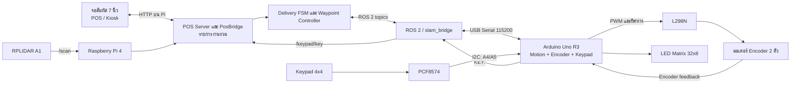

# Hardware & System Architecture Design

เอกสารนี้อธิบายฮาร์ดแวร์และสถาปัตยกรรมของหุ่นยนต์ส่งอาหารรุ่นปัจจุบัน โดยใช้ Arduino Uno R3 หนึ่งบอร์ดร่วมกับ Raspberry Pi 4 ระบบปัจจุบันไม่มี Arduino ตัวที่ 2, IR sensor, LCD 16x2 แยก หรือปุ่ม Manual Override แป้น Keypad เป็นช่องทางควบคุมทางเลือกของ POS/Kiosk บนจอสัมผัส

## 1. โครงสร้างทางกายภาพ

หุ่นยนต์มีโครงสร้าง 3 ชั้น: ฐานควบคุมอยู่ชั้นล่าง ถาดอาหารชั้น 1 อยู่ระดับกลาง และถาดอาหารชั้น 2 อยู่ชั้นบน ใช้ระบบขับเคลื่อน Differential Drive ด้วยมอเตอร์มี Encoder สองตัวและล้อขับขนาด 130 mm สองล้อ มี caster สี่ล้อรองรับตัวรถ

```text
         +-----------------------------------------+
         |  ชั้นบน: ถาดอาหารชั้น 2                    |
         |  LED Matrix 32x8 ติดด้านท้าย               |
         +-----------------------------------------+
         |  ชั้นกลาง: ถาดอาหารชั้น 1                   |
         +-----------------------------------------+
         |  ฐาน: แบตเตอรี่, วงจรไฟ, Pi 4, Arduino     |
         |  L298N และตัวแปลง DC-DC                  |
         +-----------------------------------------+
           caster      ล้อขับ 2 ล้อ      caster
             (ด้านหน้า/หลังของตัวรถมี caster รวม 4 ล้อ)
```

ค่าที่ firmware/configuration ใช้คำนวณการเคลื่อนที่คือรัศมีล้อ 0.065 m, ระยะห่างล้อ 0.343 m และ 1920 encoder ticks ต่อรอบ ดูค่าปัจจุบันได้ที่ [robotconfig.h](../src/Arduino_1_Motion/robotconfig.h) และ [config.py](../src/config.py)

## 2. สถาปัตยกรรมระบบ



Raspberry Pi 4 เป็นคอมพิวเตอร์หลักสำหรับ POS/Kiosk, การจัดการภารกิจ, waypoint และ LiDAR safety guard ส่วน Arduino Uno อ่าน Encoder และ Keypad, ควบคุมมอเตอร์ผ่าน L298N และควบคุม LED Matrix

ในโหมด ROS ที่ใช้โดยชุดเริ่มระบบปัจจุบัน <code>slam_bridge.py</code> ถือพอร์ต USB Serial ของ Arduino อ่านบรรทัด <code>ENCODER:</code>, <code>STATUS:</code> และ <code>KEY:</code> แล้วส่งสถานะที่เกี่ยวข้องเข้า ROS 2 โดย Keypad ส่งต่อผ่าน topic <code>/keypad/key</code> ไปยัง POS บน Pi หากใช้ backend แบบ Serial โดยตรง <code>odometry.py</code> จะอ่านบรรทัด Keypad จากพอร์ตเดียวกันและส่งให้ POS โดยตรง

หน้าจอสัมผัสและ Keypad ควบคุม POS draft ชุดเดียวกัน หน้าจอ POS บน Kiosk เป็นช่องทางหลัก; Keypad ใช้แทนการกดหน้าจอสำหรับการตั้งงานและยืนยันรับอาหาร โดย POS ยังคงแสดงสถานะและคำแนะนำ

| สถานะ POS  | ปุ่ม                             | การทำงาน                                      |
| ---------- | -------------------------------- | --------------------------------------------- |
| รอรับงาน   | <code>A</code> / <code>B</code>  | เลือกชั้น 2 / ชั้น 1 และเปิดแผง Keypad บน POS |
| รอรับงาน   | <code>1</code> / <code>2</code>  | เลือกโต๊ะ 1 / โต๊ะ 2 ให้ชั้นที่เลือก          |
| รอรับงาน   | <code>C</code>                   | เปลี่ยนสถานะยืนยันอาหารบนชั้นที่เลือก         |
| รอรับงาน   | <code>D</code> / <code>\*</code> | ล้างรายการของชั้นที่เลือก / ล้างรายการทั้งหมด |
| รอรับงาน   | <code>#</code>                   | เริ่มภารกิจเมื่อรายการพร้อม                   |
| รอรับอาหาร | <code>#</code>                   | ยืนยันรับอาหารที่โต๊ะปัจจุบัน                 |
| ข้อผิดพลาด | <code>\*</code>                  | ขอรีเซ็ตภารกิจ                                |

เมื่อกำหนดโต๊ะใหม่ POS Server ปัจจุบันตั้งสถานะอาหารของชั้นนั้นเป็นยืนยันแล้ว; ปุ่ม `C` ใช้สลับสถานะนี้ จึงควรตรวจสถานะบน Kiosk ก่อนเริ่มงาน

ในสถานะอื่น Keypad จะไม่เปลี่ยนภารกิจ การวางอาหารบนชั้นเป็นการตรวจยืนยันโดยผู้ใช้ผ่าน POS หรือ Keypad ไม่มี sensor ตรวจการวางหรือหยิบอาหาร

## 3. การต่อวงจรและอินเทอร์เฟซ

### Arduino Uno R3

| พิน                | สัญญาณ         | หน้าที่                            |
| ------------------ | -------------- | ---------------------------------- |
| D4                 | LED Matrix DIN | รับข้อมูล MAX7219                  |
| D5                 | LED Matrix CS  | เลือก MAX7219                      |
| D6                 | LED Matrix CLK | สัญญาณนาฬิกา MAX7219               |
| D7                 | L298N IN4      | กำหนดทิศทางมอเตอร์ขวา              |
| D8–D9              | L298N IN1–IN2  | กำหนดทิศทางมอเตอร์ซ้าย             |
| D10                | L298N ENA      | PWM มอเตอร์ซ้าย                    |
| D11                | L298N ENB      | PWM มอเตอร์ขวา                     |
| D12                | L298N IN3      | กำหนดทิศทางมอเตอร์ขวา              |
| A0–A3              | Encoder        | Encoder สองเฟสของมอเตอร์ซ้ายและขวา |
| A4 (SDA), A5 (SCL) | I2C            | PCF8574 สำหรับ Keypad              |

PCF8574 ใช้ address เริ่มต้น <code>0x20</code>; ใน configuration ของ Keypad กำหนดแถว Row ต่อ P7–P4 และ Column ต่อ P3–P0 ดูรายละเอียดที่ [Arduino1Keypad.h](../src/Arduino_1_Motion/Arduino1Keypad.h)

Arduino ส่งข้อมูลผ่าน USB Serial ที่ 115200 baud โดยใช้ข้อความขึ้นบรรทัดใหม่ เช่น <code>KEY:A</code>, <code>ENCODER:ซ้าย,ขวา</code> และ <code>STATUS:DONE</code> Raspberry Pi ต่อกับ Arduino ผ่านสาย USB B to USB A; RPLIDAR ต่อเข้ากับ Pi ทาง USB ส่วนจอสัมผัสต่อภาพผ่าน Micro HDMI และข้อมูล touch ผ่าน USB

### จอและไฟแสดงผล

จอสัมผัส Aprotii ขนาด 7 นิ้วแสดง POS/Kiosk บน Raspberry Pi จึงทำหน้าที่แสดงรายการงาน สถานะภารกิจ และการยืนยันรับอาหารแทน LCD ตัวอักษรแยกต่างหาก

LED Matrix ขนาด 32x8 ใช้ MAX7219 จำนวน 4 โมดูลและต่อกับ Arduino เพื่อแสดงลูกศรไฟเลี้ยวตามคำสั่งจาก Raspberry Pi

## 4. ระบบจ่ายไฟ

แหล่งจ่ายหลักเป็นแบตเตอรี่ลิเธียม 12 V 15 Ah พร้อมสวิตช์ 12 V และ bus bar สำหรับกระจายไฟ วงจร L298N รับไฟฝั่งมอเตอร์จากระบบ 12 V ส่วน buck converter 10 A และตัวแปลง DC-DC แบบอะแดปเตอร์ที่ติดตั้งอยู่ลดแรงดันให้เหมาะกับอุปกรณ์อิเล็กทรอนิกส์ เช่น Pi, Arduino และจอสัมผัส รายละเอียดการแยกสาขาแรงดันให้ยึดตามการต่อวงจรจริง ไม่อนุมานจากพิกัดชื่อโมดูลเพียงอย่างเดียว

มอดูล Rideon อ่าน/แสดงสถานะแบตเตอรี่ที่ระบุช่วง 8–72 V ต่อกับระบบแบตเตอรี่ 12 V ส่วน bus bar 14 ช่องสองชุดและ 5 ช่องหนึ่งชุดใช้กระจายสายไฟในฐานรถ

## 5. รายการอุปกรณ์ (BOM)

| ลำดับ | รายการ                                                   |   จำนวน |
| ----- | -------------------------------------------------------- | ------: |
| 1     | Step Down DC-DC 10A Buck Step-down                       |       1 |
| 2     | แกนต่อมอเตอร์หกเหลี่ยม Extended motor shaft 30 mm [6 mm] |       4 |
| 3     | UNO R3 แบบถอดชิปได้ พร้อมสาย USB                         |       1 |
| 4     | ABS Case พร้อมพัดลม สำหรับ Raspberry Pi 4 (OEM)          |       1 |
| 5     | Kingston microSD Card 64GB Canvas Select Plus            |       1 |
| 6     | ZENOVA แบตเตอรี่ลิเธียม 12V 15Ah พร้อมเครื่องชาร์จ       |       1 |
| 7     | RPLIDAR A1M8-R6, 360 Degree Laser Scanner                |       1 |
| 8     | Raspberry Pi 4 Model B, 4GB                              |       1 |
| 9     | สวิตช์ DC 12V                                            |       1 |
| 10    | L298N Motor Driver Module                                |       1 |
| 11    | PCF8574                                                  |       1 |
| 12    | Keypad Matrix 4x4                                        |       1 |
| 13    | LED Matrix 32x8                                          |       1 |
| 14    | Arduino UNO Terminal Shield                              |       1 |
| 15    | Bus Bar 14 ช่อง                                          |       2 |
| 16    | Bus Bar 5 ช่อง                                           |       1 |
| 17    | มอเตอร์ DC Encoder JGB37-520                             |       2 |
| 18    | ล้อยางขนาด 130 mm                                        |       2 |
| 19    | มอดูลอ่านความจุแบตเตอรี่ Rideon DC 8V–72V                |       1 |
| 20    | จอสัมผัส Aprotii ขนาด 7 นิ้ว (HDMI)                      |       1 |
| 21    | สาย Micro HDMI to HDMI ยาว 1.5 m                         |       1 |
| 22    | สาย Micro USB to USB A ยาว 2 m                           |       1 |
| 23    | สาย USB B to USB A ยาว 2 m                               |       1 |
| 24    | อะลูมิเนียมโปรไฟล์ 20x20 ยาว 1 m                         |       1 |
| 25    | ข้อต่ออะลูมิเนียมโปรไฟล์                                 |       8 |
| 26    | แผ่นอะคริลิกหนา 5 mm ขนาด 60x60 cm                       |       1 |
| 27    | สายไฟจัมเปอร์                                            | ไม่ระบุ |
| 28    | น็อตและสกรู                                              | ไม่ระบุ |

> รายการ caster wheels ไม่ปรากฏเป็นรายการแยกใน BOM ที่ได้รับ แต่ผังตัวรถปัจจุบันใช้ caster 4 ล้อตามข้อมูลยืนยันของโครงสร้างรถ
