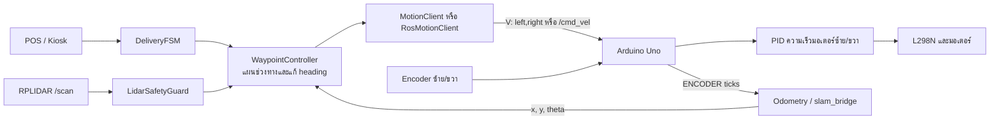

# หลักการควบคุมการเดินของหุ่นยนต์

เอกสารนี้อธิบายเส้นทางควบคุมการเคลื่อนที่ที่ใช้กับงานส่งอาหารปัจจุบัน ตั้งแต่ FSM รับงานจาก POS, การสร้างช่วงทางและแก้มุมด้วย odometry บน Raspberry Pi, การแปลงความเร็วเป็นคำสั่งล้อ ไปจนถึงวงควบคุมความเร็วมอเตอร์และ feedback จาก encoder บน Arduino Uno

> เส้นทางงานปัจจุบันเป็น fixed-route ระหว่างครัว ทางแยก และโต๊ะ 1/2 ไม่ใช่ free-space planner แบบ Nav2 เอกสารนี้อธิบายการทำงานของโค้ดจริง รวมถึงค่าที่ตั้งไว้และข้อจำกัดที่ควรทราบ

## ภาพรวมเส้นทางควบคุม

บทบาทของแต่ละชั้น:

1. `DeliveryFSM` จัดลำดับงาน เช่น เตรียมออก เดินทาง รอรับอาหาร และกลับครัว
2. `WaypointController` เลือก heading กับระยะของแต่ละช่วงทาง แล้วใช้ตำแหน่งและ heading จาก odometry ปรับคำสั่งระหว่างเดิน
3. `MotionClient` หรือ `RosMotionClient` ส่งความเร็วแบบต่อเนื่องให้ Arduino โดยตรงหรือผ่าน ROS 2
4. Firmware บน Uno ควบคุมความเร็วล้อซ้ายและขวาด้วย encoder feedback; วงนี้ไม่คำนวณ heading ของตัวรถ
5. LiDAR safety guard สั่งหยุดช่วงการเคลื่อนที่เมื่อพบสิ่งกีดขวางใน safety zone ไม่ได้วางแผนเส้นทางหลบ

จุดเริ่มของงานอยู่ที่ [main.py](../src/main.py) ซึ่งสร้าง `WaypointController` แล้วส่งให้ [delivery_fsm.py](../src/delivery_fsm.py) ส่วนค่าทางกายภาพและ waypoint อยู่ใน [config.py](../src/config.py)

## แบบจำลองรถและสัญลักษณ์

หุ่นยนต์ใช้ระบบขับเคลื่อนสองล้อแบบ differential drive ให้กำหนด:

| สัญลักษณ์ | ความหมาย | ค่าที่ตั้งในโค้ด |
| --- | --- | --- |
| `R` | รัศมีล้อ | `0.065 m` |
| `B` | ระยะห่างระหว่างศูนย์กลางล้อซ้ายกับขวา | `0.343 m` |
| `N` | encoder ticks ต่อรอบล้อ | `1920 ticks/rev` |
| `v` | ความเร็วเดินหน้า/ถอยหลังของจุดกึ่งกลางรถ | `m/s` |
| `ω` | ความเร็วเชิงมุมรอบแกนตั้ง; บวกคือทวนเข็มนาฬิกา | `rad/s` |
| `vL`, `vR` | ความเร็วล้อซ้ายและขวา | `m/s` |
| `(x, y, θ)` | ตำแหน่งและ heading ของรถในระนาบ | `m`, `rad` |

โค้ดกำหนดกรอบ waypoint โดยให้จุดครัวเป็น `(0, 0)` และทิศออกจากครัวเป็น `+X`:

- ทางแยก: `(JUNCTION_X, 0)` ค่าเริ่มต้น `JUNCTION_X = 2.0 m`
- โต๊ะ 1: `(JUNCTION_X, +TABLE1_Y)` ค่าเริ่มต้น `TABLE1_Y = 0.6 m`
- โต๊ะ 2: `(JUNCTION_X, -TABLE2_Y)` ค่าเริ่มต้น `TABLE2_Y = 0.6 m`

ค่าระยะเหล่านี้มาจาก [config.py](../src/config.py) และเปลี่ยนได้ผ่าน `.env` ตามคู่มือตั้งค่า รถใช้ระยะทางตามช่วงที่กำหนด ไม่ได้ไล่พิกัดโต๊ะด้วย planner ทั่วไป

## Odometry: แปลง encoder เป็นตำแหน่งและมุม

### ระยะทางต่อ encoder tick

หนึ่งรอบล้อเคลื่อนที่ได้เส้นรอบวง `2πR` ดังนั้นระยะต่อ tick คือ

\[
 m_{tick} = \frac{2\pi R}{N}
\]

แทนค่าปัจจุบัน:

\[
 m_{tick} = \frac{2\pi(0.065)}{1920}
 \approx 0.0002128\;m/tick
\]

หรือประมาณ `0.213 mm/tick` โดย `config.py` ใช้ค่านี้เป็น `METERS_PER_TICK` ส่วน firmware คำนวณค่าเดียวกันเป็น `METERS_PER_PULSE`

### จาก tick delta เป็นการเคลื่อนที่

เมื่อได้รับจำนวน tick สะสมรอบใหม่ ให้หาผลต่างของแต่ละล้อ:

\[
\Delta s_L = \Delta ticks_L \cdot m_{tick}
\qquad
\Delta s_R = \Delta ticks_R \cdot m_{tick}
\]

ระยะที่จุดกึ่งกลางรถเคลื่อนที่ และการเปลี่ยน heading คำนวณจาก:

\[
\Delta s = \frac{\Delta s_L + \Delta s_R}{2}
\qquad
\Delta\theta = \frac{\Delta s_R - \Delta s_L}{B_{odom}}
\]

- ถ้าสองล้อเคลื่อนที่เท่ากัน `Δθ` เป็นศูนย์ รถจึงวิ่งตรงตามแบบจำลอง
- ถ้าล้อขวาเคลื่อนที่มากกว่าล้อซ้าย `Δθ` เป็นบวก หมายถึงหมุนทวนเข็มนาฬิกา/ซ้าย
- ถ้าล้อซ้ายและขวาเคลื่อนที่คนละทิศ รถจะหมุนอยู่กับที่โดยประมาณ

จากนั้นโค้ดอินทิเกรตตำแหน่งด้วย midpoint method:

\[
 x_{k+1} = x_k + \Delta s\cos(\theta_k + \frac{\Delta\theta}{2})
\]
\[
 y_{k+1} = y_k + \Delta s\sin(\theta_k + \frac{\Delta\theta}{2})
\qquad
\theta_{k+1} = normalize(\theta_k + \Delta\theta)
\]

การใช้ heading กึ่งกลางช่วงช่วยประมาณเส้นทางโค้งระหว่าง encoder samples ได้ดีกว่าการใช้ heading ก่อนขยับเพียงอย่างเดียว มุมถูก normalize ให้อยู่ใน `[-π, +π]` ด้วย `atan2(sin θ, cos θ)` หรือสมการเทียบเท่า

การคำนวณนี้เป็น dead reckoning จาก encoder จึงสะสมความคลาดเคลื่อนจากล้อไถล เส้นผ่านศูนย์กลางล้อจริง ความคลาดเคลื่อนของระยะล้อ และ encoder ได้ ไม่มี IMU ในวงควบคุม heading นี้

### ช่องทาง odometry ที่ใช้ได้

`WaypointController` อ่าน pose ผ่าน callback เดียวกัน แต่แหล่งข้อมูลขึ้นกับ `MOTION_BACKEND` ใน [main.py](../src/main.py):

- **`serial` (ค่าเริ่มต้น):** คลาส `Odometry` อ่าน `ENCODER:L,R` จาก serial โดยตรงและใช้ `WHEEL_BASE = 0.343 m` ในสูตรมุม
- **`ros`:** `RosOdometry` ใช้ `/odom` จาก `slam_bridge.py` ซึ่งคำนวณจาก encoder เช่นกัน ใน bridge นี้ `B_odom = WHEEL_BASE × ODOM_TRACK_WIDTH_FACTOR`; ค่า factor เริ่มต้น `1.185` จึงได้ประมาณ `0.406 m` เพื่อชดเชยความต่างระหว่างมุมหมุนที่วัดได้กับแบบจำลอง

การชดเชย track width ใช้กับ odometry ใน ROS เท่านั้น ส่วนแปลง `/cmd_vel` เป็นความเร็วล้อยังคงใช้ `WHEEL_BASE = 0.343 m` ตามโค้ด หัวข้อ ROS/SLAM เป็นทางส่ง pose/แสดงผลและ safety; เส้นทางส่งอาหารนี้ไม่ได้ใช้ AMCL หรือ Nav2 ระบุตำแหน่งเป้าหมาย

## แผนเส้นทางของภารกิจ

เมื่อ POS ส่งงาน FSM จะหยุดคำสั่งความเร็ว รอ 5 วินาที และเรียก `begin_mission()` ก่อนออกเดิน ใน `begin_mission()` controller รอ feedback ที่พร้อมและบันทึก heading ปัจจุบันเป็น `H` (สูงสุด 12 วินาทีตามค่าตั้งต้น) จากนั้นถือว่าตำแหน่งเชิงตรรกะเป็น `home`

สำหรับ ROS backend เงื่อนไขพร้อมตรวจ `/arduino/ready` และความใหม่ของ `/odom` ซึ่งต้องมีอายุไม่เกิน 1 วินาที ส่วน serial backend ที่สร้างใน `main.py` ใช้ ready/fresh provider ซึ่งคืน `True` เสมอ จึงไม่ได้ตรวจ freshness แบบ ROS

มุมเป้าหมายคำนวณจากกรอบภารกิจ:

\[
H_{table1} = normalize(H + 90^\circ)
\qquad
H_{table2} = normalize(H - 90^\circ)
\qquad
H_{kitchen} = normalize(H + 180^\circ)
\]

เส้นทางโดยย่อ:

| ตำแหน่งปัจจุบัน | งาน | ขั้นตอน |
| --- | --- | --- |
| ครัว | ไปโต๊ะ 1 | เดินตรง `JUNCTION_X` ที่ heading `H` → หมุนไป `H+90°` → เดิน `TABLE1_Y` |
| ครัว | ไปโต๊ะ 2 | เดินตรง `JUNCTION_X` ที่ heading `H` → หมุนไป `H−90°` → เดิน `TABLE2_Y` |
| โต๊ะหนึ่ง | ไปอีกโต๊ะ | หมุนไป heading ของโต๊ะเป้าหมาย → เดิน `ระยะโต๊ะเดิม + ระยะโต๊ะใหม่` ผ่านทางแยก |
| โต๊ะ | กลับครัว | หมุนหันเข้าทางแยก → เดินระยะจากโต๊ะถึงทางแยก → หมุนไป `H+180°` → เดิน `JUNCTION_X` → หมุนกลับไป `H` |

FSM เรียก `go_to_table()` ตอนส่งแต่ละรายการและ `return_home()` เมื่อส่งครบใน [waypoint_controller.py](../src/waypoint_controller.py) / [delivery_fsm.py](../src/delivery_fsm.py)

### การจับมุมตั้งต้นไม่ใช่การจัดแนวก่อนออก

`begin_mission()` บันทึก heading ที่อ่านได้เป็น `H` แต่ไม่ได้สั่งหมุนให้ตรงกับทิศ `+X` ก่อนเริ่มเดิน ช่วงแรกจากครัวจึงสั่งให้รักษามุมที่วัดได้ตอนเริ่มภารกิจ ถ้าตัวรถหันผิดแนวอยู่ก่อนเริ่ม งานจะถือแนวนั้นเป็นแกนอ้างอิงใหม่ การหมุนไป heading ที่วางแผนจะเกิดภายหลังเมื่อถึงจุดทางแยก

## วงควบคุมชั้นนอก: รักษามุมระหว่างวิ่งตรง

`drive_forward(distance, target_heading)` ทำงานที่ความถี่ `20 Hz` (`control_period = 0.05 s`) และกำหนดความเร็วเดินหน้าเริ่มต้น `v = 0.22 m/s` ทุกตัวอย่าง controller อ่าน `(x, y, θ)` แล้วคำนวณ heading error:

\[
e_\theta = normalize(\theta_{target} - \theta)
\]

กฎสร้าง angular velocity correction ในโค้ดคือ:

\[
\omega =
\begin{cases}
0 & |e_\theta| \le 1^\circ \\
sign(e_\theta)\cdot\max(0.12,\min(0.5, 1.8|e_\theta|)) & |e_\theta| > 1^\circ
\end{cases}
\]

ในสมการนี้ error คำนวณเป็นเรเดียน ดังนั้น `1.8` เป็น gain ที่เปลี่ยน radian ของ error เป็น `rad/s`; ผลลัพธ์ถูกจำกัดอยู่ในช่วง `±0.5 rad/s` และเมื่อ error เกิน deadband จะมีความเร็วเชิงมุมขั้นต่ำ `0.12 rad/s` เพื่อให้การแก้มีผลกับมอเตอร์

ตัวอย่าง: ถ้า error เป็น `+10° = +0.1745 rad`, ค่าตาม P gain คือ `1.8×0.1745 ≈ 0.314 rad/s` จึงยังไม่ชนเพดาน `0.5`; เครื่องหมายบวกสั่งเลี้ยวซ้ายเพื่อให้ heading เข้าใกล้เป้าหมาย

controller ส่ง `(v, ω)` ไปแปลงเป็นความเร็วล้อแบบ differential drive:

\[
v_L = v - \frac{\omega B}{2}
\qquad
v_R = v + \frac{\omega B}{2}
\]

โดย `B=0.343 m` ตัวอย่าง `v=0.22 m/s` และ `ω=+0.12 rad/s` จะได้ `vL≈0.199 m/s`, `vR≈0.241 m/s`; ล้อขวาเร็วกว่าเพื่อเลี้ยวซ้าย ค่าที่คำนวณได้ถูกส่งซ้ำทุก control cycle จนเดินครบระยะหรือพบเงื่อนไขหยุด

**นี่คือ heading correction ระหว่างการเคลื่อนที่** ไม่ใช่การจัดมุมก่อนออกตัว หากเริ่มต้นมุมคลาด controller จะพยายามกลับไปที่มุมเป้าหมายขณะรถกำลังวิ่ง

## วงควบคุมการหมุนไป heading เป้าหมาย

ก่อนเปลี่ยนทิศช่วงทาง `turn_to_heading()` คำนวณ error แบบมุมสั้นที่สุด:

\[
e = normalize(\theta_{target} - \theta_{current})
\]

- ถ้า `|e| ≤ 2.5°` จะไม่หมุน และสั่งหยุด continuous velocity
- ถ้าคลาดมากกว่านั้น จะกำหนด turn intent ซ้าย/ขวาตามเครื่องหมายของ `e` และสั่ง `v=0` พร้อม angular velocity ที่มีเครื่องหมายเดียวกับ error
- เมื่อเหลือมุมตั้งแต่ `45°` ขึ้นไป ใช้ `max_angular_speed = 0.75 rad/s`
- เมื่อเหลือน้อยกว่า `45°` ลดความเร็วเชิงมุมลงแบบเส้นตรง ระหว่าง `0.60` ถึง `0.75 rad/s` โดยยังคงขั้นต่ำ `0.60 rad/s`

เขียนความเร็วในช่วงชะลอได้เป็น:

\[
p = clamp\left(\frac{|e|-2.5^\circ}{45^\circ-2.5^\circ}, 0, 1\right)
\qquad
|\omega| = 0.60 + (0.75-0.60)p
\]

เมื่อ heading เข้า tolerance controller ส่งความเร็วศูนย์ รอ `0.15 s` แล้วอ่านมุมอีกครั้ง ถ้าตอนหยุดล้อทำให้มุมคลาดเกิน tolerance จะกลับไปแก้ต่อ การหมุนจึงปิด loop ด้วย odometry ไม่ได้อาศัยคำสั่งหมุนจำนวนองศาครั้งเดียว

ในขณะหมุน controller จะหยุดและรอเมื่อ safety guard พบ obstacle โดยเพิ่มเวลาหยุดนั้นให้ deadline ด้วย ค่า timeout เริ่มต้นคำนวณจาก:

\[
t_{max} = \frac{|e_{initial}|}{\max(0.75, 0.1)}\times3 + 6\;s
\]

และถือว่าไม่คืบหน้าหาก error ไม่ลดลงอย่างน้อย `1.5°` นานกว่า `4 s`

## ระยะเดิน การจบช่วงทาง และเงื่อนไขหยุด

ระยะทางที่ controller ใช้ในแต่ละช่วงเป็นผลรวมของระยะเคลื่อนที่จาก odometry:

\[
d_{travelled} \leftarrow d_{travelled} + \sqrt{(x_k-x_{k-1})^2+(y_k-y_{k-1})^2}
\]

ช่วงทางถือว่าจบเมื่อ `d_travelled ≥ distance − 0.05 m` โดย `ARRIVAL_TOLERANCE_M=0.05 m` ถ้าระยะเป้าหมายน้อยกว่าหรือเท่ากับ tolerance ฟังก์ชันจบทันทีโดยไม่ส่งคำสั่งเดิน

ระหว่างวิ่งจะหยุดเมื่อเกิดกรณีใดกรณีหนึ่ง:

- feedback readiness/pose ไม่พร้อม (ใน ROS backend)
- เกิน timeout ซึ่งตั้งต้นเป็น `(distance / max(linear_speed, 0.05)) × 2.5 + 5 s`
- ไม่มีความคืบหน้าจาก odometry อย่างน้อย `0.01 m` นานกว่า `4 s`
- ผู้ใช้ยกเลิกงาน
- LiDAR safety guard ตรวจพบสิ่งกีดขวาง

เมื่อพบสิ่งกีดขวาง controller ส่งความเร็วศูนย์ รอหนึ่งรอบควบคุม แล้วประเมินใหม่จนพื้นที่ปลอดภัย โดยขยาย deadline ตามเวลาที่หยุด ไม่ได้เลี้ยวหลบหรือคำนวณเส้นทางใหม่

`LidarSafetyGuard` ค่าเริ่มต้นใช้ safety cone ด้านหน้า `±35°`, ระยะหยุด `0.30 m`, ตัดจุดใกล้ตัวถังที่ต่ำกว่า `0.22 m` และต้องมีจุดที่ผ่านเงื่อนไขอย่างน้อย `3` จุดใน scan หนึ่งครั้งจึงแจ้งว่าพบ obstacle การประมวลผลอยู่ใน [lidar_safety.py](../src/lidar_safety.py); ระยะหยุดปรับได้ด้วย `LIDAR_STOP_DIST` และ yaw offset ปรับได้ด้วย `LIDAR_YAW_OFFSET`

## ชั้นส่งคำสั่งและแปลงความเร็วล้อ

มี transport สองแบบ แต่ทั้งคู่รับคำสั่งจาก `WaypointController` รูป `(linear_v, angular_w)`:

### Serial backend

`MotionClient.drive_continuous()` คำนวณ `vL/vR` ด้วยสมการ differential drive แล้วส่งบรรทัด `V:<vL>,<vR>` ผ่าน USB Serial ไป Uno โดยปัดค่าความเร็วเป็นทศนิยมสามตำแหน่ง `MOTION_BACKEND` มีค่าเริ่มต้นเป็น `serial`

### ROS backend

`RosMotionClient.drive_continuous()` ส่ง `Twist` ไป `/cmd_vel` โดย `linear.x=v` และ `angular.z=ω`; `slam_bridge.py` รับข้อความ แปลงเป็นความเร็วล้อ แล้วส่ง `V:<vL>,<vR>` ทาง Serial ไป Uno

ใน ROS backend มีตัวแปรกลับเครื่องหมายที่ bridge รองรับ ได้แก่ `INVERT_LINEAR`, `INVERT_STEER`, `INVERT_LEFT_ENC`, `INVERT_RIGHT_ENC` และ `INVERT_ODOM_YAW` ค่าตั้งต้นในโค้ดคือกลับ linear และ steer (`1`) แต่ไม่กลับ yaw/encoder (`0`) ต้องให้ convention ของคำสั่งและ odometry สอดคล้องกัน มิฉะนั้นการแก้มุมอาจหมุนออกจากเป้าหมาย

`MotionClient.forward()` ที่ส่ง `FORWARD:<เมตร>` และ `MotionClient.turn()` ที่ส่ง `TURN:<องศา>` เป็น primitive แบบ blocking ที่ firmware ยังรองรับ แต่เส้นทางส่งอาหารปัจจุบันใช้ `WaypointController` กับ continuous velocity (`V:` หรือ `/cmd_vel`) ไม่ได้ใช้คำสั่งเหล่านี้เป็นวิธีนำทางหลัก

## วงควบคุมชั้นในบน Arduino Uno

Firmware ใน [Arduino_1_Motion.ino](../src/Arduino_1_Motion/Arduino_1_Motion.ino) ทำงานควบคุมที่ `50 Hz` (`CONTROL_INTERVAL_MS=20 ms`) และส่ง encoder ticks ทุก `100 ms` สำหรับ continuous velocity command มีงานสองระดับ:

1. Raspberry Pi ตัดสินใจความเร็วเป้าหมายของล้อซ้าย/ขวาจากตำแหน่งและ heading
2. Uno ทำ PID แยกต่อหนึ่งล้อ เพื่อติดตามความเร็วเป้าหมายของล้อนั้น

สำหรับแต่ละล้อ Arduino คำนวณ:

\[
v_{raw} = \frac{\Delta ticks\cdot m_{tick}}{dt}
\qquad
v_{measured} = 0.85v_{previous} + 0.15v_{raw}
\]

จากนั้นหา speed error และสะสม integral:

\[
e_v = v_{target} - v_{measured}
\qquad
I_k = clamp(I_{k-1}+e_vdt, -2, 2)
\]

อนุพันธ์ในโค้ดคำนวณจากการเปลี่ยนของความเร็วที่วัดได้ `dSpeed=(actualSpeed-lastSpeed)/dt` แล้วรวม feed-forward กับ PID เป็น PWM:

\[
PWM = \frac{v_{target}}{0.25}\cdot200 + 150e_v + 10I_k - 1.2dSpeed
\]

ค่าคงที่ `Kp=150`, `Ki=10`, `Kd=1.2` และ `CRUISE_SPEED_MPS=0.25` อยู่ใน firmware ผลลัพธ์จำกัดที่ `[-255,255]`; ถ้า target ไม่เป็นศูนย์และ PWM มีขนาดต่ำกว่า `35` จะยกเป็น PWM ขั้นต่ำเพื่อช่วยเอาชนะแรงเสียดทาน

ถ้าล้อตัวใดได้รับ target มากกว่า `0.05 m/s` แต่ encoder ไม่ขยับ จะเริ่มเพิ่ม stall assist หลัง `350 ms` เพิ่มทีละ `20 PWM` ทุก `250 ms` สูงสุด `120 PWM` และ latch stall fault หลังไม่มี encoder motion `3 s` กลไกนี้ช่วยตรวจ/ปลด static friction แต่ไม่ได้แก้ heading; ถ้าล้อหยุด ระบบรายงาน stall และหยุดมอเตอร์

### Wheel Sync ของคำสั่งระยะทางเดิม

Firmware ยังมี `executeForward()` สำหรับคำสั่ง primitive `FORWARD:<distance>` ซึ่งปรับ target ความเร็วซ้าย/ขวาตามผลต่างระยะ encoder:

\[
e_{pos}=(d_L-d_R)
\qquad
sync=1.5e_{pos}
\]
\[
v_{L,target}=v_{ramp}-sync
\qquad
v_{R,target}=v_{ramp}+sync
\]

ฟังก์ชันนี้มี ramp ความเร็ว `0.005 m/s` ต่อรอบ, cruise `0.25 m/s` และเริ่มชะลอในระยะสุดท้าย `0.20 m` อย่างน้อย `0.04 m/s` แต่ active waypoint route ไม่ได้เรียก `FORWARD:`; การรักษามุมในเส้นทางปัจจุบันมาจาก outer loop บน Pi และส่ง wheel-speed targets ต่อเนื่อง ส่วนการหมุน `TURN:<องศา>` ของ firmware ก็นับ tick ตามเรขาคณิตล้อ แต่ active route ใช้ `turn_to_heading()` ปิด loop ด้วย odometry

## ขอบเขตและความหมายของคำว่า “แก้มุม”

ในระบบนี้คำว่าแก้มุมอาจหมายถึงคนละวงควบคุม:

| การทำงาน | ที่อยู่ในโค้ด | ทำงานเมื่อใด |
| --- | --- | --- |
| จับมุมเริ่มภารกิจ | `WaypointController.begin_mission()` | ก่อนเริ่ม route; อ่านค่า `H` อย่างเดียว ไม่มีการหมุนจัดแนว |
| รักษา heading ระหว่างตรง | `WaypointController.drive_forward()` | เดินหน้าแต่ละช่วง; คำนวณ `ω` จาก heading error ทุก 0.05 วินาที |
| หมุนเข้ามุมของช่วงถัดไป | `WaypointController.turn_to_heading()` | ที่ทางแยก/ก่อนเดินช่วงใหม่; หมุนจน odometry อยู่ใน ±2.5° |
| คุมความเร็วล้อ | `PIDController.compute()` บน Uno | ตลอดที่มีคำสั่งความเร็ว; ลดความต่างระหว่าง target speed กับ encoder speed |
| wheel sync แบบคำสั่งระยะทาง | `executeForward()` บน Uno | เฉพาะ primitive `FORWARD:`; ไม่ใช่ทางเดินหลักของ waypoint route |

ดังนั้น encoder PID ทำให้แต่ละล้อตามความเร็วที่สั่ง ส่วน heading correction เกิดจากการอ่านความต่าง encoder สองล้อเป็น odometry แล้วให้ Raspberry Pi ปรับความเร็วซ้าย/ขวาอีกชั้นหนึ่ง

## ไฟเลี้ยวและการแก้ heading

Pi ส่ง turn intent เฉพาะเมื่อ `turn_to_heading()` เริ่มหมุนจริง และปิด intent หลังหมุนเสร็จ การปรับ `ω` เล็ก ๆ ระหว่างเดินตรงไม่ได้เรียก turn intent ดังนั้น LED Matrix ใช้แสดงการเลี้ยวตามช่วง route ไม่ได้สะท้อนทุก correction ของ heading รายละเอียด protocol และ firmware อยู่ใน [motion_client.py](../src/motion_client.py) และ [Arduino_1_Motion.ino](../src/Arduino_1_Motion/Arduino_1_Motion.ino)

## จุดที่ควรตรวจเมื่อปรับจูน

- วัดเส้นผ่านศูนย์กลางล้อจริงและจำนวน encoder tick ต่อรอบภายใต้น้ำหนักบรรทุกจริง เพราะมีผลกับทั้งระยะและ heading odometry
- วัดระยะห่างล้อจริง และสำหรับ ROS backend ตรวจ `ODOM_TRACK_WIDTH_FACTOR` โดยเทียบมุมหมุนจริงกับมุมที่รายงาน
- ตรวจเครื่องหมายของ encoder ซ้าย/ขวาและ `INVERT_*` ให้การขับไปข้างหน้าเพิ่ม odometry ตามแกนที่ต้องการ และการสั่ง `ω>0` ให้ heading เพิ่ม
- ปรับ `JUNCTION_X`, `TABLE1_Y`, `TABLE2_Y` ให้ตรงกับทางจริง เนื่องจาก controller เดินตามระยะที่ตั้งไว้
- ปรับ gain `1.8`, deadband `1°`, angular correction limits `0.12–0.5 rad/s`, heading tolerance `2.5°` และ speed PID ในสภาพพื้นที่จริงอย่างระมัดระวัง; ค่าเหล่านี้มีอยู่หลายชั้นและมีหน่วยต่างกัน
- ทำความเข้าใจว่า odometry แบบ encoder สะสม drift; LiDAR safety หยุดเมื่อพบวัตถุด้านหน้า แต่ไม่ได้ใช้แก้ pose หรือเบี่ยงเส้นทางใน waypoint controller

## ไฟล์โค้ดอ้างอิง

- [src/waypoint_controller.py](../src/waypoint_controller.py) — mission frame, route, outer heading loop, turn loop และ stop conditions
- [src/odometry.py](../src/odometry.py) — serial/ROS pose interface และ encoder dead reckoning แบบ serial
- [src/motion_client.py](../src/motion_client.py) — แปลงความเร็วและเลือก serial/ROS transport
- [src/slam_bridge.py](../src/slam_bridge.py) — ROS `/cmd_vel`, wheel conversion และ encoder odometry
- [src/Arduino_1_Motion/Arduino_1_Motion.ino](../src/Arduino_1_Motion/Arduino_1_Motion.ino) — firmware PID, velocity watchdog, encoder และ primitive motion
- [src/config.py](../src/config.py) — ค่าล้อ, waypoint และ tolerance
- [src/lidar_safety.py](../src/lidar_safety.py) — front safety cone และ obstacle pause
