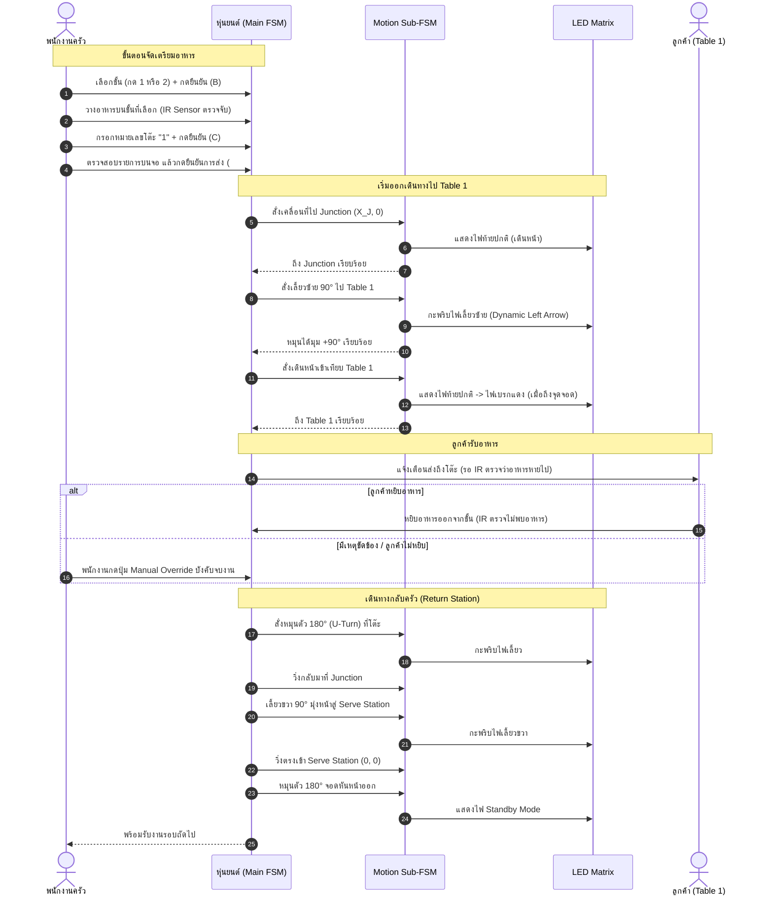

# Operation Scenarios - ระบบหุ่นยนต์ส่งอาหาร

เอกสารนี้ระบุรายละเอียดแผนผังพื้นที่ (Restaurant Layout) และสถานการณ์การทำงานจริง (Operation Scenarios) ของหุ่นยนต์ส่งอาหารอัตโนมัติ

---

## 1. ผังร้านอาหารและเส้นทางการเคลื่อนที่ (Layout & Coordinates)

```
+-------------------------------------------------------------+
|                                                             |
|                                         +---------+         |
|                                         | Table 1 |         |
|                                         +----+----+         |
|                                              |              |
|                                              |              |
| +-------------+                              | (Junction)   |
| |             |==============================+==============|
| |             |        Robot Walk Line       |              |
| |    Serve    |                              |              |
| |   Station   |                              |              |
| |  (Kitchen)  |                         +----+----+         |
| |             |                         | Table 2 |         |
| +-------------+                         +---------+         |
|                                                             |
+-------------------------------------------------------------+
```

### การกำหนดจุดอ้างอิงและพิกัด (Odometry Coordinates)
กำหนดจุดเริ่มต้นที่ **Serve Station** เป็นจุดกำเนิด $(0, 0)$ โดยหุ่นยนต์หันหน้าไปทางแกน $+X$ ($\theta = 0^\circ$):

| ตำแหน่ง (Location) | พิกัด $(X, Y)$ | Heading ($\theta$) | คำอธิบาย |
| :--- | :---: | :---: | :--- |
| **Serve Station (Home)** | $(0, 0)$ | $0^\circ$ | จุดจอดรับอาหารและเตรียมพร้อม (หันหน้าออกไปทางร้าน) |
| **Junction (ทางแยกหลัก)** | $(X_J, 0)$ | $0^\circ$ | จุดตัดกลางทางเดินสำหรับแยกไปโต๊ะ 1 และโต๊ะ 2 |
| **Table 1** | $(X_J, +Y_1)$ | $+90^\circ$ | โต๊ะ 1 (อยู่ทางซ้ายมือของทางเดินหลัก) |
| **Table 2** | $(X_J, -Y_2)$ | $-90^\circ$ | โต๊ะ 2 (อยู่ทางขวามือของทางเดินหลัก) |

---

## 2. Scenario 1: การเสิร์ฟโต๊ะเดี่ยว (Single Table Delivery - ตัวอย่าง Table 1)

สถานการณ์การนำอาหารไปส่งที่โต๊ะ 1 เพียงโต๊ะเดียวแล้ววิ่งกลับมาที่ครัว



---

## 3. Scenario 2: การเสิร์ฟ 2 โต๊ะพร้อมกัน (Multi-Table Delivery - Table 1 & Table 2)

สถานการณ์วางอาหาร 2 ชั้นสำหรับ 2 โต๊ะในรอบเดียว หุ่นยนต์จะวิ่งไปส่งโต๊ะแรก $\rightarrow$ โต๊ะที่สอง $\rightarrow$ วิ่งกลับครัว

### ลำดับขั้นตอนการทำงาน (Action Flow)
1. **โหลดอาหารที่ครัว (Serve Station)**:
   - วางอาหารชั้น 1 $\rightarrow$ กำหนดส่ง **Table 1**
   - วางอาหารชั้น 2 $\rightarrow$ กำหนดส่ง **Table 2**
   - พนักงานกด `#` ยืนยันการออกส่ง
2. **นำส่งโต๊ะที่ 1 (Table 1)**:
   - หุ่นยนต์วิ่งตรงไปที่ Junction $\rightarrow$ เลี้ยวซ้าย $90^\circ$ $\rightarrow$ เทียบจอด Table 1
   - แสดงไฟเบรก $\rightarrow$ รอตรวจพบว่าอาหารชั้น 1 ถูกหยิบออก (หรือกด Manual Override)
3. **นำส่งโต๊ะที่ 2 (Table 2)**:
   - หุ่นยนต์ตรวจพบว่ายังมีอาหารค้างส่งอยู่ที่ชั้น 2
   - หุ่นยนต์หมุนตัว $180^\circ$ $\rightarrow$ วิ่งกลับมาที่ Junction
   - วิ่งตรงข้ามแยกไปยัง **Table 2**
   - เทียบจอด Table 2 $\rightarrow$ รอตรวจพบว่าอาหารชั้น 2 ถูกหยิบออก
4. **กลับ Serve Station**:
   - ตรวจสอบพบว่าไม่มีอาหารค้างอยู่บนหุ่นยนต์แล้ว
   - หุ่นยนต์หมุนตัว $180^\circ$ $\rightarrow$ วิ่งกลับมาที่ Junction $\rightarrow$ เลี้ยวซ้าย $90^\circ$ เข้า Serve Station
   - เมื่อเข้าจอดที่จุด $(0, 0)$ จะหมุนตัว $180^\circ$ อีกครั้งเพื่อหันหน้าออก พร้อมรับคำสั่งรอบใหม่

---

## 4. Scenario 3: การใช้ปุ่ม Manual Override และจัดการข้อผิดพลาด

| เหตุการณ์ (Event) | สภาพปัญหา | การแก้ไขและพฤติกรรมของระบบ (System Action) |
| :--- | :--- | :--- |
| **ลูกค้าไม่หยิบอาหาร / เซนเซอร์ IR ขัดข้อง** | อาหารยังค้างอยู่บนชั้นที่โต๊ะปลายทาง | พนักงานกดปุ่ม **Manual Override** บนตัวหุ่นยนต์เพื่อข้ามสถานะ `WaitForPickup` ทันที |
| **ต้องการยกเลิกคำสั่งขณะตั้งค่าที่ครัว** | พนักงานกดเลือกชั้นหรือกรอกโต๊ะผิด | กดปุ่ม `*` ที่ Keypad ในสถานะ `WaitForIR` ระบบจะเข้าสู่ **RESET ล้างงานทั้งหมด** แล้วเริ่มใหม่ |
| **สิ่งกีดขวางบนเส้นทางเดิน** | มีคนหรือสิ่งของขวางเส้นทาง | มอเตอร์หยุดชะลอความเร็ว อัปเดต LED Matrix เป็นไฟฉุกเฉิน และรอจนกว่าทางจะโล่ง |

---

## 5. การสอดประสานระหว่างสถานะและการแสดงผล (State vs Hardware Mapping)

| สภาวะการเคลื่อนที่ | การคำนวณ Odometry | การทำงานของมอเตอร์ | การแสดงผล LED Matrix |
| :--- | :--- | :--- | :--- |
| **จอดรอคำสั่งที่ครัว** | $x=0, y=0, \theta=0^\circ$ | ปิดการขับ PWM (Stop) | แสดงไฟ Standby / โลโก้หรี่ |
| **วิ่งตรงบนทางหลัก** | $\Delta d > 0, \Delta\theta \approx 0$ | Dual PID ควบคุมความเร็ว พร้อม Wheel Sync | แสดงไฟท้ายปกติ / แถบวิ่งเดินหน้า |
| **เลี้ยวเข้าทางแยก** | $\Delta\theta = \pm 90^\circ$ | หมุนล้อซ้าย-ขวาทิศทางตรงข้าม (Differential Spin) | กะพริบไฟเลี้ยวซ้าย/ขวา ทุก 200–250ms |
| **จอดเทียบโต๊ะส่งอาหาร** | ความเร็วลดลง $0$ m/s | เบรกคงตำแหน่ง | แสดงไฟเบรกกะพริบสีแดงเตือน |
| **หมุนตัว U-Turn กลับทาง** | $\Delta\theta = 180^\circ$ | หมุนล้อแบบกลับทิศเพื่อเปลี่ยนหัวหุ่น | กะพริบไฟเลี้ยวเตือนรอบคัน |
