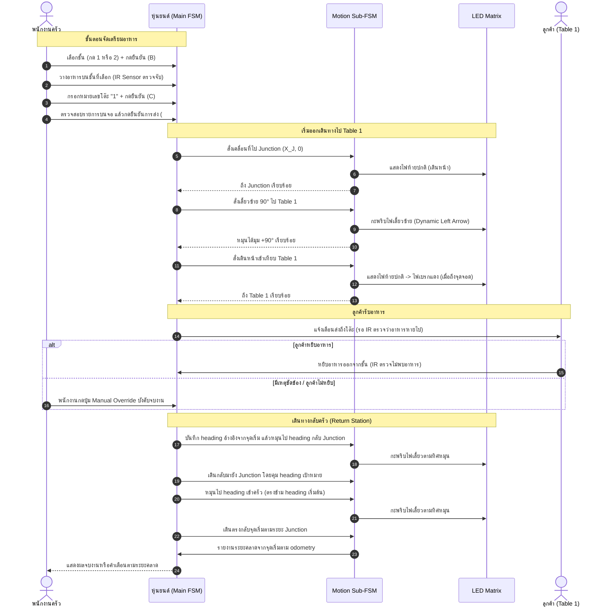

# Operation Scenarios - ระบบหุ่นยนต์ส่งอาหาร

เอกสารนี้ระบุรายละเอียดแผนผังพื้นที่ (Restaurant Layout) และสถานการณ์การทำงานจริง (Operation Scenarios) ของหุ่นยนต์ส่งอาหารอัตโนมัติ

---

## 1. ผังร้านอาหารและเส้นทางการเคลื่อนที่ (Layout & Coordinates)

```
+-------------------------------------------------------------+
|                                                             |
|                                         +---------+         |
|                                         | Table 1 |         |
|                                         +----+----+         |
|                                              |              |
|                                              |              |
| +-------------+                              | (Junction)   |
| |             |==============================+==============|
| |             |        Robot Walk Line       |              |
| |    Serve    |                              |              |
| |   Station   |                              |              |
| |  (Kitchen)  |                         +----+----+         |
| |             |                         | Table 2 |         |
| +-------------+                         +---------+         |
|                                                             |
+-------------------------------------------------------------+
```

### การกำหนดจุดอ้างอิงและพิกัด (Odometry Coordinates)
กำหนดจุดเริ่มต้นที่ **Serve Station** เป็นจุดกำเนิด $(0, 0)$ โดยหุ่นยนต์หันหน้าไปทางแกน $+X$ ($\theta = 0^\circ$):

| ตำแหน่ง (Location) | พิกัด $(X, Y)$ | Heading ($\theta$) | คำอธิบาย |
| :--- | :---: | :---: | :--- |
| **Serve Station (Home)** | $(0, 0)$ | $0^\circ$ | จุดจอดรับอาหารและเตรียมพร้อม (หันหน้าออกไปทางร้าน) |
| **Junction (ทางแยกหลัก)** | $(X_J, 0)$ | $0^\circ$ | จุดตัดกลางทางเดินสำหรับแยกไปโต๊ะ 1 และโต๊ะ 2 |
| **Table 1** | $(X_J, +Y_1)$ | $+90^\circ$ | โต๊ะ 1 (อยู่ทางซ้ายมือของทางเดินหลัก) |
| **Table 2** | $(X_J, -Y_2)$ | $-90^\circ$ | โต๊ะ 2 (อยู่ทางขวามือของทางเดินหลัก) |

---

## 2. Scenario 1: การเสิร์ฟโต๊ะเดี่ยว (Single Table Delivery - ตัวอย่าง Table 1)

สถานการณ์การนำอาหารไปส่งที่โต๊ะ 1 เพียงโต๊ะเดียวแล้ววิ่งกลับมาที่ครัว



### การควบคุมเส้นทางใน `start_scenario.sh` (Real Robot)

โหมดหุ่นยนต์จริงใช้เส้นทางแบบลำดับตายตัวตามระยะทางที่เลือก ไม่ได้ใช้ global path planner การเริ่มงานจะบันทึก pose จาก `/odom` เป็นจุดอ้างอิง $(x_0, y_0, H)$ แล้วกำหนด heading ของทุกช่วงจาก heading เริ่มต้น $H$:

ตารางนี้แสดง heading ของ Scenario 1:

| ช่วงเส้นทาง | Heading เป้าหมาย |
| :--- | :---: |
| ครัว → Junction | $H$ |
| Junction → Table 1 | $H + 90^\circ$ |
| Table 1 → Junction | $H - 90^\circ$ |
| Junction → ครัว | $H + 180^\circ$ |

Scenario 2 ใช้หลักเดียวกัน: จาก Junction หันไป Table 1 ที่ $H+90^\circ$ แล้วหันไป Table 2 ที่ $H-90^\circ$; หลังส่ง Table 2 จะหันกลับไป Junction ที่ $H+90^\circ$ และเข้าครัวที่ $H+180^\circ$ ระยะระหว่างโต๊ะคำนวณจากระยะของแต่ละฝั่ง Junction

ทุกมุมจะถูกปรับให้อยู่ในช่วง $[-180^\circ, 180^\circ]$ การหมุนใช้คำสั่งความเร็วเชิงเส้นเป็นศูนย์ เพื่อให้ล้อสองข้างหมุนสวนทางกันและหมุนอยู่กับที่ เมื่อเข้าใกล้มุมเป้าหมายจะลดความเร็วจากสูงสุด $0.75$ เหลืออย่างน้อย $0.60$ rad/s ในช่วง 45 องศาสุดท้าย จากนั้นหยุด รอ odometry อัปเดต และตรวจมุมซ้ำ โดยยอมรับเมื่อคลาดไม่เกิน $\pm 2.5^\circ$ เท่านั้น

ใน Real Robot Mode การเปิด /dev/ttyACM0 อย่างเดียวไม่นับว่า Arduino พร้อมทำงาน Bridge จะยืนยัน /arduino/ready หลังได้รับ ENCODER:L,R ที่ถูกต้องและข้อมูลยังสดอยู่เท่านั้น หากพอร์ตเปิดแต่ข้อมูลไม่ถูกต้อง Bridge จะไม่ส่งคำสั่งขับที่ไม่ใช่ศูนย์และไม่เผยแพร่ odometry จาก encoder; Scenario Runner จะรอทั้งสถานะ ready และ /odom ได้สูงสุด 12 วินาทีแล้วหยุดโดยไม่เริ่มภารกิจ โหมด laser/mock ที่ไม่มี serial อาจยังเผยแพร่ odometry คงที่เพื่อดู LiDAR แต่ไม่สามารถผ่าน preflight ของ Real Robot Mode ได้

แต่ละช่วงเดินตรงจะคุม heading ตาม heading ที่วางไว้ของช่วงนั้น ไม่ตั้ง heading ใหม่จากความคลาดหลังเลี้ยวรอบก่อน เมื่อจบเส้นทางจะคำนวณระยะระหว่าง pose สุดท้ายกับจุดเริ่มจาก odometry หากคลาดเกิน `ARRIVAL_TOLERANCE_M` (ปัจจุบัน 0.05 m) จะแสดงคำเตือนแทนข้อความว่าส่งงานสำเร็จ

**สาเหตุของอาการรถกลับมาเยื้อง:** ก่อนแก้ การหมุนยอมรับความคลาดได้ถึง 5 องศา และช่วงเดินถัดไปยึด yaw ที่อ่านได้หลังเลี้ยวเป็น heading ใหม่ ความคลาดเล็กน้อยจึงกลายเป็นทิศทางของเส้นทางช่วงถัดไป และสะสมเป็นระยะเยื้อง ซึ่งเห็นตรงกันทั้งบนรถจริงและใน RViz การแก้ปัจจุบันยึด heading ทุกช่วงกับ pose เริ่มต้นและตรวจมุมหลังหยุดก่อนเดินต่อ

> **ข้อจำกัด:** Return Check ใช้ `/odom` ซึ่งมาจาก dead reckoning ของ encoder จึงใช้รายงานความคลาดที่ระบบประเมินได้ แต่ไม่ได้ปรับตำแหน่งรถกลับเข้าจุดเริ่มด้วย map localization และไม่รับประกันความแม่นยำทางกายภาพเมื่อ odometry มี drift

---

## 3. Scenario 2: การเสิร์ฟ 2 โต๊ะพร้อมกัน (Multi-Table Delivery - Table 1 & Table 2)

สถานการณ์วางอาหาร 2 ชั้นสำหรับ 2 โต๊ะในรอบเดียว หุ่นยนต์จะวิ่งไปส่งโต๊ะแรก $\rightarrow$ โต๊ะที่สอง $\rightarrow$ วิ่งกลับครัว

### ลำดับขั้นตอนการทำงาน (Action Flow)
1. **โหลดอาหารที่ครัว (Serve Station)**:
   - วางอาหารชั้น 1 $\rightarrow$ กำหนดส่ง **Table 1**
   - วางอาหารชั้น 2 $\rightarrow$ กำหนดส่ง **Table 2**
   - พนักงานกด `#` ยืนยันการออกส่ง
2. **นำส่งโต๊ะที่ 1 (Table 1)**:
   - หุ่นยนต์วิ่งตรงไปที่ Junction $\rightarrow$ เลี้ยวซ้าย $90^\circ$ $\rightarrow$ เทียบจอด Table 1
   - แสดงไฟเบรก $\rightarrow$ รอตรวจพบว่าอาหารชั้น 1 ถูกหยิบออก (หรือกด Manual Override)
3. **นำส่งโต๊ะที่ 2 (Table 2)**:
   - หุ่นยนต์ตรวจพบว่ายังมีอาหารค้างส่งอยู่ที่ชั้น 2
   - หุ่นยนต์หมุนตัว $180^\circ$ $\rightarrow$ วิ่งกลับมาที่ Junction
   - วิ่งตรงข้ามแยกไปยัง **Table 2**
   - เทียบจอด Table 2 $\rightarrow$ รอตรวจพบว่าอาหารชั้น 2 ถูกหยิบออก
4. **กลับ Serve Station**:
   - ตรวจสอบพบว่าไม่มีอาหารค้างอยู่บนหุ่นยนต์แล้ว
   - หุ่นยนต์หมุนตัว $180^\circ$ $\rightarrow$ วิ่งกลับมาที่ Junction $\rightarrow$ หมุนซ้าย $90^\circ$ เข้าหา Serve Station
   - วิ่งตรงกลับตามระยะจาก Junction ถึงครัว แล้วตรวจระยะคลาดจากจุดเริ่มตาม odometry (จอดโดยหันเข้าครัว)

---

## 4. Scenario 3: การใช้ปุ่ม Manual Override และจัดการข้อผิดพลาด

| เหตุการณ์ (Event) | สภาพปัญหา | การแก้ไขและพฤติกรรมของระบบ (System Action) |
| :--- | :--- | :--- |
| **ลูกค้าไม่หยิบอาหาร / เซนเซอร์ IR ขัดข้อง** | อาหารยังค้างอยู่บนชั้นที่โต๊ะปลายทาง | พนักงานกดปุ่ม **Manual Override** บนตัวหุ่นยนต์เพื่อข้ามสถานะ `WaitForPickup` ทันที |
| **ต้องการยกเลิกคำสั่งขณะตั้งค่าที่ครัว** | พนักงานกดเลือกชั้นหรือกรอกโต๊ะผิด | กดปุ่ม `*` ที่ Keypad ในสถานะ `WaitForIR` ระบบจะเข้าสู่ **RESET ล้างงานทั้งหมด** แล้วเริ่มใหม่ |
| **สิ่งกีดขวางบนเส้นทางเดิน** | มีคนหรือสิ่งของขวางเส้นทาง | มอเตอร์หยุดชะลอความเร็ว อัปเดต LED Matrix เป็นไฟฉุกเฉิน และรอจนกว่าทางจะโล่ง |

---

## 5. การสอดประสานระหว่างสถานะและการแสดงผล (State vs Hardware Mapping)

| สภาวะการเคลื่อนที่ | การคำนวณ Odometry | การทำงานของมอเตอร์ | การแสดงผล LED Matrix |
| :--- | :--- | :--- | :--- |
| **จอดรอคำสั่งที่ครัว** | $x=0, y=0, \theta=0^\circ$ | ปิดการขับ PWM (Stop) | แสดงไฟ Standby / โลโก้หรี่ |
| **วิ่งตรงบนทางหลัก** | $\Delta d > 0, \Delta\theta \approx 0$ | Dual PID ควบคุมความเร็ว พร้อม Wheel Sync | แสดงไฟท้ายปกติ / แถบวิ่งเดินหน้า |
| **เลี้ยวเข้าทางแยก** | $\Delta\theta = \pm 90^\circ$ | หมุนล้อซ้าย-ขวาทิศทางตรงข้าม (Differential Spin) | กะพริบไฟเลี้ยวซ้าย/ขวา ทุก 200–250ms |
| **จอดเทียบโต๊ะส่งอาหาร** | ความเร็วลดลง $0$ m/s | เบรกคงตำแหน่ง | แสดงไฟเบรกกะพริบสีแดงเตือน |
| **หมุนตัว U-Turn กลับทาง** | $\Delta\theta = 180^\circ$ | หมุนล้อแบบกลับทิศเพื่อเปลี่ยนหัวหุ่น | กะพริบไฟเลี้ยวเตือนรอบคัน |
